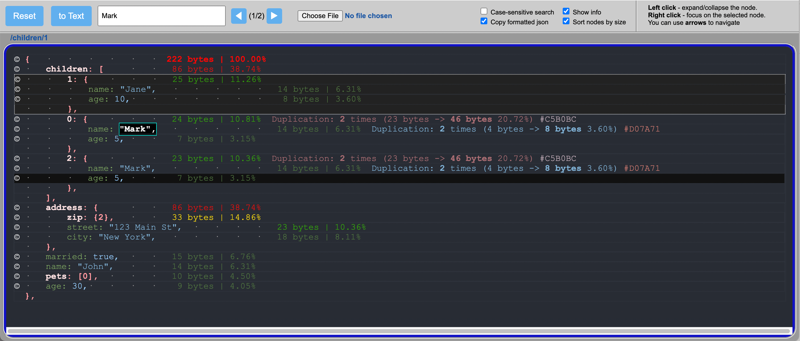

# jsonSize
The tool for analyzing large JSONs to find heavy nodes and repetitive fragments with the aim of optimizing size.

## How to use

You only need the file [jsonSize.html](https://github.com/ahtartam/jsonSize/blob/main/jsonSize.html) . Download it locally and open it in your browser.

